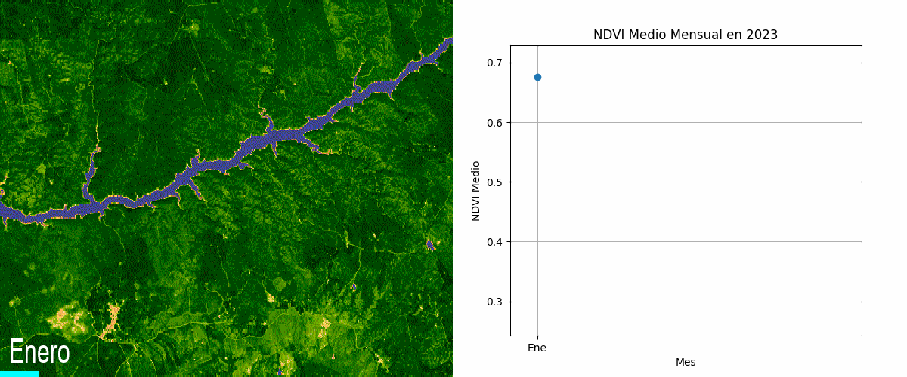

# Variación del *Sentinel 2 NDVI* en la Vegetación de España continental. 

+------------------------------------------+
 Realizado a través de Google Earth Engine 
+------------------------------------------+

----

¡Bienvenido a este pequeño proyecto! Aquí exploramos cómo el clima mediterráneo afecta la calidad de la vegetación a lo largo del año en la España continental. Utilizamos el Índice de Vegetación de Diferencia Normalizada (NDVI) extraído de las imágenes de `Sentinel 2` para visualizar estos cambios.

## Clima Mediterráneo y Vegetación

El clima mediterráneo se caracteriza por inviernos suaves y lluviosos, y veranos calurosos y secos. Esta fuerte sequía estival tiene un impacto significativo en el paisaje, reduciendo considerablemente la cantidad de vegetación verde durante los meses de verano. A través de este proyecto, podrás observar cómo la vegetación cambia mes a mes, reflejando las estaciones y el estrés hídrico durante el verano.

## Zona de Estudio

La zona de estudio seleccionada es un tramo del curso medio del río Tajo, en la provincia de Cáceres. Esta región es representativa del clima mediterráneo y permite observar claramente los efectos de la sequía estival en la vegetación.

## Animación del NDVI

A continuación, puedes ver una animación que muestra la variación del NDVI en la vegetación de España continental a lo largo de un año. Esta animación ilustra claramente la disminución del verde durante los meses de verano y su recuperación en las estaciones más húmedas.

## Cómo se Hizo

Para este proyecto, se utilizaron imágenes de Sentinel 2 y se procesaron los datos para extraer el NDVI de distintas regiones a lo largo del año. Aquí tienes un resumen del flujo de trabajo:

1. **Obtención de imágenes**: Las imágenes de Sentinel 2 se descargaron utilizando la plataforma de Earth Engine (Copernicus Dataset).
2. **Procesamiento de imágenes**: Se utilizó Google Earth Engine (API de Python) para calcular el NDVI de cada imagen, a traves de Python, así como las series temporales .
3. **Creación de la animación**: Se compilaron las imágenes procesadas en un GIF animado para visualizar la variación del NDVI a lo largo del tiempo.

`Todo el trabajo se ha realizado a través de python, donde se puede ver en el Jupyter Notebook en este repositorio.`

## Contribuciones

Este es un proyecto abierto y agradecemos cualquier tipo de contribución. Si tienes ideas para mejorarlo o encuentras algún problema, no dudes en abrir un issue o enviar un pull request.

## Licencia

Este proyecto está bajo la licencia MIT. Para más detalles, consulta el archivo [LICENSE](LICENSE).

---

¡Gracias por visitar este repositorio! Esperamos que encuentres interesante cómo el clima mediterráneo influye en la vegetación de España continental.

